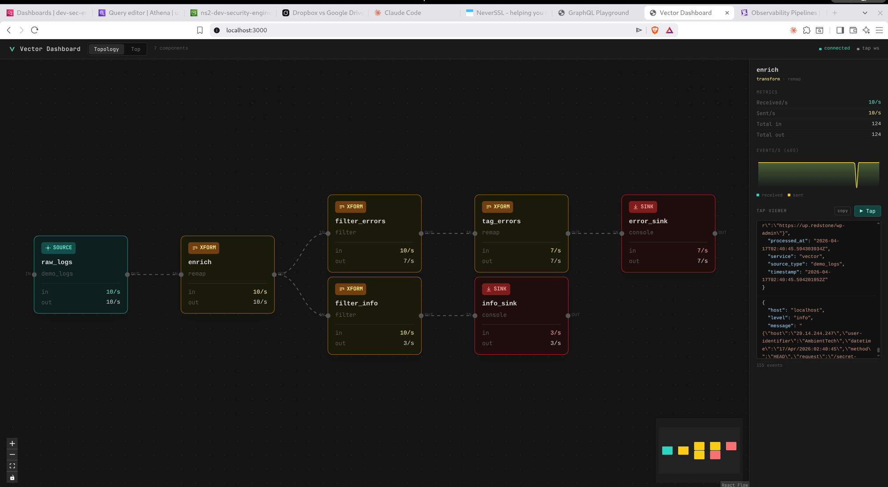
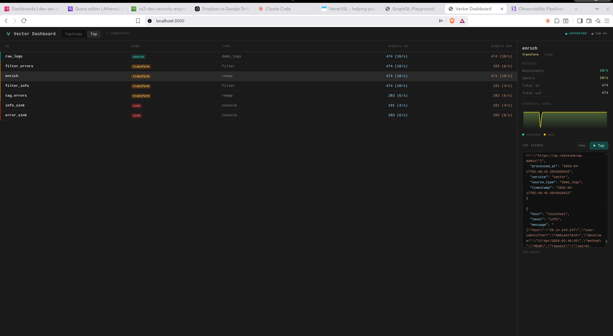

# Vector Dashboard

A real-time observability dashboard for [Vector](https://vector.dev) pipelines. Visualizes topology, live metrics, and event streams via Vector's GraphQL API.

## Screenshots

**Topology view** — interactive graph showing pipeline components and live throughput:



**Top view** — `vector top`-style table with per-component event rates:



## Features

- **Topology graph** — DAG layout of sources → transforms → sinks with live in/out rates
- **Top table** — sortable component table (ID, kind, type, events in/out with rates)
- **Live tap** — subscribe to any component's output stream via WebSocket; events rendered with JSON syntax highlighting
- **Metrics sparkline** — 60-second rolling chart of received/sent events per second
- **Auto-refresh** — topology polls every 5s, metrics every 1s

## Stack

| Layer | Technology |
|---|---|
| Frontend | React 18, TypeScript, Vite, Tailwind CSS, ReactFlow, Recharts |
| Backend | Bun, TypeScript |
| Pipeline | [Vector](https://vector.dev) with GraphQL API enabled |
| Transport | HTTP (GraphQL proxy) + WebSocket (live tap) |
| Runtime | Docker Compose |

## Running locally

**Prerequisites:** Docker, Docker Compose

```bash
git clone <repo>
cd vector-dashboard
docker compose up --build
```

Then open [http://localhost:3000](http://localhost:3000).

| Service | Port | Description |
|---|---|---|
| Frontend | 3000 | React app (nginx) |
| Backend | 3001 | Bun API + WebSocket server |
| Vector API | 8686 | GraphQL endpoint |

## Architecture

```
Browser
  ├── HTTP → :3001/graphql → Vector :8686/graphql   (topology + metrics polling)
  └── WS   → :3001/ws                               (live tap)
                └── WS graphql-transport-ws → Vector :8686/graphql
```

The backend proxies all GraphQL queries to Vector and manages WebSocket tap subscriptions using Vector's `outputEventsByComponentIdPatterns` subscription.

## Demo pipeline

The included `vector.toml` runs a demo HTTP log pipeline:

```
raw_logs (demo_logs)
  └── enrich (remap: parse HTTP status → derive level)
        ├── filter_errors (4xx/5xx) → tag_errors (add alert metadata) → error_sink
        └── filter_info  (2xx/3xx)                                    → info_sink
```

## Configuration

Set the Vector API URL via environment variable on the backend:

```bash
VECTOR_API=http://vector:8686   # default
```
